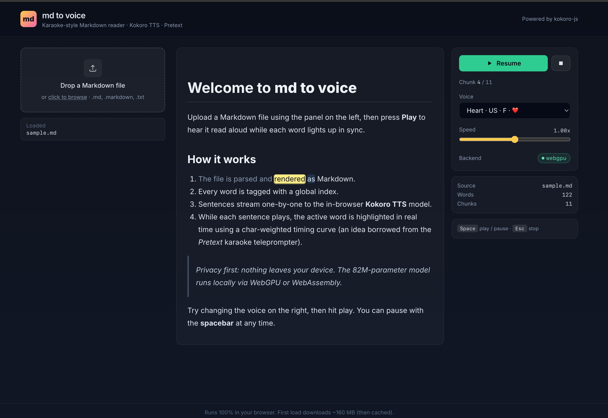

# md to voice

A React app that turns a Markdown file into a karaoke-style read-along, fully in your browser.



- **In-browser TTS** using [`kokoro-js`](https://www.npmjs.com/package/kokoro-js) (the 82M-parameter Kokoro model running on WebGPU or WebAssembly via Transformers.js).
- **Word-by-word highlighting** synced to the audio, layered on top of the rendered Markdown — Unicode-aware word segmentation by [`@chenglou/pretext`](https://www.npmjs.com/package/@chenglou/pretext).
- **No backend.** Nothing leaves your device. The TTS model is downloaded once (~160 MB) and then cached by the browser.
- **Offline-ready PWA.** The app shell, JS, CSS, ORT WebAssembly runtime, and TTS worker are precached via a service worker, and the Hugging Face model fetches are runtime-cached, so subsequent visits work without a network.
- **Documents in IndexedDB** with searchable recents, sort by **Last played**, **Date added**, or **File name**, and per-document resume.

## How it works

1. The uploaded Markdown is parsed by `unified` + `remark-parse` + `remark-gfm`.
2. A custom remark plugin walks the mdast and replaces every text node with a sequence of `word` and `whitespace` nodes, each `word` carrying a globally-incrementing index. Word splitting uses Pretext's `Intl.Segmenter`-based segmentation.
3. `remark-rehype` converts the augmented mdast to hast, with custom handlers turning `word` nodes into `<span class="word" data-w-idx="N">…</span>` and `whitespace` nodes into plain text.
4. The result renders as a normal styled Markdown document — headings, lists, code, tables, links, blockquotes — but every word is now individually addressable.
5. A sentence-level chunker groups words into TTS-sized batches (3–30 words, broken at `.`/`!`/`?`).
6. A Web Worker hosts `kokoro-js` and generates a WAV per chunk; the player plays each chunk sequentially while pre-fetching the next two.
7. Inside each chunk, a `requestAnimationFrame` loop maps `audio.currentTime` to the active word using a character-length-weighted timing curve (the same trick Pretext's "karaoke teleprompter" demo uses).

## Stack

| Concern | Library |
| --- | --- |
| Build | Vite + React 19 + TypeScript |
| Markdown | `react-markdown` / unified pipeline, `remark-gfm` |
| Tokenization | `@chenglou/pretext` (`prepareWithSegments`), `unist-util-visit` |
| TTS | `kokoro-js` running in a `Worker` |
| Persistence | IndexedDB (documents), `localStorage` (settings) |
| Styling | Tailwind CSS |

## Run locally

```bash
npm install --ignore-scripts   # --ignore-scripts skips the optional `sharp` build (we don't need it; Kokoro runs in the browser)
npm run dev
```

Open http://localhost:5173 and drop a `.md` file on the left.

> The first time you press **Play**, the browser downloads the Kokoro model (~160 MB) from the Hugging Face Hub. After that it is served from the browser cache and starts instantly.

## Build & test

```bash
npm run build
npm run preview
npm test
```

## Keyboard shortcuts

| Key | Action |
| --- | --- |
| `Space` | Play / Pause |
| `Esc` | Stop |
| `[` or `←` | Previous chunk |
| `]` or `→` | Next chunk |

## Notes & limitations

- **English only.** Kokoro currently supports US/UK English voices.
- **WebGPU is preferred** (Chrome 113+/Edge 113+); WASM is the automatic fallback.
- Code blocks are rendered as Markdown but **skipped by the TTS** (not added to the chunk plan).
- Word-level timing is interpolated from the per-chunk audio duration; it is intentionally a heuristic, not a forced alignment. It feels in sync at normal speeds.

## License

MIT.
